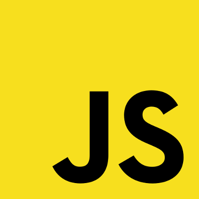

# MeJ Tech : Les modificateurs d’accès privé ("#", "_")

2023-06-27

---

## Le contexte

<!--
Discussion de départ
https://1024pix.slack.com/archives/C658LDBAQ/p1686835164003269
-->

Le modificateur d’accès privé ("#") natif commence à être utilisé dans le code de Pix API et dans plusieurs PR de Pix API.
<!-- .element: class="fragment" -->

Ce modificateur d’accès privé ("#") natif :
<!-- .element: class="fragment" -->

* remet en cause l'usage historique du underscore ("_")
<!-- .element: class="fragment" -->
* entre conflit entre avec les descriptions dans les tests describe("#myMethod"…)
<!-- .element: class="fragment" -->

→ De nombreuses personnes souhaitent un partage de connaissances sur le
sujet et idéalement une standardisation des pratiques au niveau de Pix.
<!-- .element: class="fragment" -->

---

## Vocabulaire

built-in : fonctionnalité/feature disponible de base dans JavaScript
<!-- .element: class="fragment" -->

Programmation orientée objet (POO) = Object-Oriented Programming (OOP)
<!-- .element: class="fragment" -->

Member/field/membre/donnée membre/champ : un attribut ou une méthode de classe
<!-- .element: class="fragment" -->

Private member/private field = Membre privé/champ privé
<!-- .element: class="fragment" -->

Membre privé (private member) → cela s'applique à une classe
<!-- .element: class="fragment" -->

(et pas à un module)
<!-- .element: class="fragment" -->

---

## Là où il y a des problématiques d'accès

La notion de propriété privée (private property) n'existe pas dans ces cas :
<!-- .element: class="fragment" -->
* pour les built-in Object ({})
<!-- .element: class="fragment" -->
* les modules (ESM, CommonJS)
<!-- .element: class="fragment" -->

Les problématiques d'accès existent dans ces cas :
<!-- .element: class="fragment" -->
* instances de classe (POO)
<!-- .element: class="fragment" -->
* modules (ESM, CommonJS)
<!-- .element: class="fragment" -->

---

## La doc de référence

MDN : Private class features

https://developer.mozilla.org/en-US/docs/Web/JavaScript/Reference/Classes/Private_class_fields

(dans la version en-US)

---

## Concrètement

---

### Les modules

De tout temps, tout ce qui n'est pas exporté n'est pas disponible à l'extérieur du module

Le mot clé built-in `export` est **nécessaire et suffisant** pour cela

---

### Les classes

Pendant très longtemps la notion de membre privé (private member) n'était pas disponible en JavaScript

La convention de préfixer par `_` était donc utilisée pour signifier qu'un membre était privé

---

### Les différents cas chez Pix

Pour les membres privés on a 2 cas chez Pix :

* côté navigateur
   * pour *mon-pix*, *orga*, *certif*, *admin*, *1d* : Ember.js
   * pour *pix-site*, *tutos.pix.fr* : Nuxt

* côté serveur (pour *api* : Node.js)

---

### Côté navigateur

→ Babel

car les navigateurs à supporter sont assez anciens

---

### Côté serveur

Depuis Node.js 12.0.0 (2019) disponibilité du modificateur d’accès privé natif ("#")

---

### Convention sur les noms des tests

Les noms de certains tests du code de Pix suivent les conventions de la communauté Ruby (les années 2010) pour le nommage des méthodes
d'instances et de classes :

`#do_stuff`

`.do_more_stuff`

https://stackoverflow.com/questions/31413525/test-description-notation-for-attributes

---

### Avantages du modificateur d’accès privé natif ("#")

`_` est une information visuelle, alors que `#` est une info visuelle et une info sémantique au niveau du langage

Les membres préfixés par `_` sont toujours appelables par inadvertance ou ignorance

---

## Bonne pratique

Avoir une propriété privée et un accesseur ayant quasiment le même nom

---

### Bonne pratique, exemple de code

```javascript
class OidcAuthenticationService {
  #isReady = false;

  constructor({
    identityProvider,
    configKey,
  }) {
    this.identityProvider = identityProvider;
    this.configKey = configKey;

    if (!this.configKey) {
      logger.error(`${this.constructor.name}: Missing configKey`);
      return;
    }

    this.#isReady = true;
  }

  get isReady() {
    return this.#isReady;
  }
}
```

---

## Implications pour les tests 

On ne peut absolument pas accéder à une propriété privée
<!-- .element: class="fragment" -->

→ On ne peut pas la stub
<!-- .element: class="fragment" -->

→ Cela oblige à tester des comportements plutôt que des implémentations
<!-- .element: class="fragment" -->

→ C'est bien cela rend les tests plus métier et plus compréhensibles mais cela peut demander aussi plus de travail
<!-- .element: class="fragment" -->

---

### Implications pour les tests, exemple de test

```javascript
it('returns true', function () {
  // given
  const oidcAuthenticationService = new OidcAuthenticationService({
    identityProvider: 'someIdentityProvider',
    configKey: 'someOidcProviderService',
  });

  // when
  const result = oidcAuthenticationService.isReady;

  // then
  expect(result).to.be.true;
});
```

---

## Propositions

A. Dans les classes, utiliser des modificateurs d’accès privé `#` natifs pour tout nouveau code

B. Dans les modules, ne pas préfixer par underscore `_` les variables et fonctions non-exportées, car la visibilité est déjà exprimée par le fait que l'élément est exporté ou non

B.1. Dans les modules, les variables et fonctions exportées doivent être exportées inline 

```javascript
export const name1 = 'someValue';

export function functionName1() {
  // …
}
```

C. Renommer les noms de tests `#aMethod`→`.aMethod`, `#aProperty`→`.aProperty`, car c'est comme ça qu'on y accède

D. Pas d'obligation de modification du code existant

E. Plus tard, mise en place d'une configuration de linting (no-underscore-dangle) pour interdire les `_`, avec exceptions locales si pertinent (eslint-disable)

---

## Moment d'échange

Remarques et questions

---

## FIN
